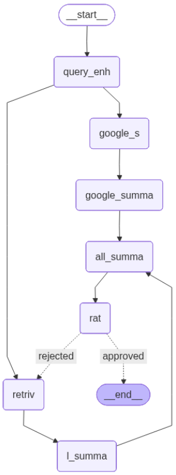

<div align="center">

# 📚 Smart Document Assistant

**Multi-Modal RAG with Hybrid Search & Web Integration**

[](https://www.python.org/)
[](https://fastapi.tiangolo.com/)
[](https://reactjs.org/)
[](https://www.typescriptlang.org/)

*An advanced Retrieval-Augmented Generation system that transforms PDFs into an intelligent, searchable knowledge base with web-augmented answers*

[Features](#-features) • [Quick Start](#-quick-start) • [How It Works](#️-how-it-works) • [API](#-api-reference)

</div>

---

## 📸 Preview

<div align="center">


*Beautiful, modern chat interface with PDF upload and intelligent Q&A*

</div>

---

## ✨ Features

<div align="center">

| 🎯 **Core Capabilities** | 🚀 **Advanced Features** |
|------------------------|--------------------------|
| 📄 **PDF Processing** | 🔍 **Hybrid Search** (Keyword + Semantic) |
| 🖼️ **Image Extraction** | 🌐 **Web Search Integration** |
| 📊 **Table Analysis** | 💬 **Conversation Memory** |
| 🛠️ **Tool Integration** | ⚡ **Real-time Streaming** |

</div>

### What Makes It Special

- **🎨 Multi-Modal Processing**: Handles text, images, and tables from PDFs with AI-powered captioning
- **🔍 Hybrid Search**: Combines keyword matching and semantic vector search for optimal retrieval
- **🌐 Web-Augmented Answers**: Integrates real-time web search via Serper API when document knowledge is insufficient
- **🔄 Quality Assurance**: Automatic answer rating with intelligent retry mechanism
- **🧠 Smart Workflow**: Query enhancement, parallel retrieval, summarization, and answer merging
- **🌓 Modern UI**: Beautiful React interface with dark mode and streaming responses
- **⚡ Fast & Scalable**: OpenSearch backend with efficient vector indexing

---

## 🚀 Quick Start

### Prerequisites

Make sure you have these installed:

- 🐍 Python 3.10+
- 📦 Node.js 18+
- 🐳 Docker & Docker Compose
- 🤖 Ollama (for embeddings)

### Installation (5 minutes)

<details>
<summary><b>1️⃣ Start Infrastructure</b></summary>

```bash
# Start OpenSearch
docker-compose up -d
```

✅ OpenSearch: `http://localhost:9200`  
✅ Dashboards: `http://localhost:5601`
</details>

<details>
<summary><b>2️⃣ Setup Ollama</b></summary>

```bash
# Pull embedding model
ollama pull nomic-embed-text

# Verify it's running
curl http://localhost:11434/api/tags
```
</details>

<details>
<summary><b>3️⃣ Install Backend</b></summary>

```bash
# Create virtual environment
python -m venv .venv
source .venv/bin/activate  # Windows: .venv\Scripts\activate

# Install dependencies
pip install -r requirements.txt
pip install unstructured[pdf] langchain-google-genai langgraph opensearch-py python-dotenv
```
</details>

<details>
<summary><b>4️⃣ Install Frontend</b></summary>

```bash
cd chatbot-ui
npm install
```
</details>

<details>
<summary><b>5️⃣ Configure Environment</b></summary>

Create `.env` in root:
```env
GOOGLE_API_KEY=your_gemini_key
SERPER_API_KEY=your_serper_key
```

Create `.env` in `chatbot-ui/`:
```env
VITE_API_BASE=http://localhost:8000
```
</details>

### 🎮 Run It!

**Terminal 1 - Backend:**
```bash
uvicorn app:app --reload --port 8000
```

**Terminal 2 - Frontend:**
```bash
cd chatbot-ui
npm run dev
```

🎉 Open `http://localhost:5173` and start chatting!

---

## 🏗️ How It Works

<div align="center">



*Complete workflow: query enhancement → parallel retrieval → summarization → merging → quality rating*

</div>

### System Architecture

The system uses a sophisticated multi-stage pipeline:

1. **🔍 Query Enhancement**  
   Uses LLM to expand and clarify user queries, adding relevant keywords and context for better retrieval

2. **⚡ Parallel Retrieval**  
   Simultaneously searches two sources:
   - **Documents**: Hybrid search (keyword + semantic) in OpenSearch vector store
   - **Web**: Real-time search via Serper API for current information

3. **📝 Dual Summarization**  
   Creates concise, focused summaries from both document and web results independently

4. **🔄 Intelligent Merging**  
   Combines summaries into a unified answer, removing contradictions and duplicates

5. **✅ Quality Rating**  
   Evaluates the final answer quality (approved/rejected)

6. **🔁 Feedback Loop**  
   If rejected, automatically re-retrieves with adjusted parameters

### Tool-Augmented Features

The `agent.py` module provides additional capabilities:

- **RAG Query Tool**: Main document retrieval and answer generation
- **Web Search Tool**: Serper API integration for current information
- **Math Tools**: Basic calculations (multiply, random addition)
- **DateTime Tool**: Current date and time queries
- **Streaming Support**: Real-time token-by-token responses

---

## 📡 API Reference

### Core Endpoints

#### `POST /ingest`
Upload and process a PDF file.

```bash
curl -X POST http://localhost:8000/ingest \
  -F "file=@document.pdf"
```

**Response:**
```json
{
  "message": "Ingestion started",
  "original_filename": "document.pdf",
  "index": "pdf_content_index"
}
```

#### `POST /query`
Ask questions about your documents.

```bash
curl -X POST http://localhost:8000/query \
  -H "Content-Type: application/json" \
  -d '{"query": "What is this document about?"}'
```

**Response:**
```json
{
  "r_g_summary": "Comprehensive answer based on documents and web search...",
  "rating": "approved",
  "conversation_id": "uuid-here"
}
```

#### `GET /health`
Check service status.

```bash
curl http://localhost:8000/health
```

### Conversation Management

| Endpoint | Method | Description |
|----------|--------|-------------|
| `/conversations/{id}` | GET | Get conversation history |
| `/conversations/{id}` | DELETE | Delete conversation |

---

## 📁 Project Structure

```
Smart-Document-Assistant/
├── 🚀 app.py              # FastAPI server & endpoints
├── 🔄 workflow_2.py       # Multi-stage RAG workflow
├── 🤖 agent.py            # LangChain tool-augmented agent
├── 📥 ingestion.py        # PDF → OpenSearch pipeline
├── 🔍 retrieval.py        # Search (keyword/semantic/hybrid)
├── ✨ generation.py       # RAG response generation
├── 📄 chunker.py          # PDF chunking & processing
├── 🛠️ helper.py           # Utilities (embeddings, clients)
├── 📦 requirements.txt    # Python dependencies
├── 🐳 docker-compose.yml  # OpenSearch setup
└── 💻 chatbot-ui/        # React frontend
    ├── src/
    │   ├── pages/chat/   # Chat interface
    │   └── components/   # UI components
    └── package.json
```

---

## 🔧 Key Components

### PDF Processing Pipeline

1. **📄 Partitioning** - Extract text, images, tables using `unstructured` library
2. **🖼️ Image Processing** - Generate captions with Gemini Vision API
3. **📊 Table Analysis** - Extract and describe table structures
4. **🧩 Semantic Chunking** - Create meaningful text chunks with overlap
5. **🔢 Embedding** - Generate 768-dimensional vectors with Ollama (nomic-embed-text)
6. **💾 Indexing** - Store in OpenSearch with vector search capabilities

### Search Methods

- **🔤 Keyword Search**: Traditional BM25 text matching in OpenSearch
- **🧠 Semantic Search**: Vector similarity using cosine distance (kNN search)
- **⚡ Hybrid Search**: Combines both methods with boolean "should" queries for optimal results

### Multi-Stage Workflow

The `workflow_2.py` implements a LangGraph state machine with:

- **Query Enhancement Node**: Expands queries with context
- **Retrieval Node**: Fetches relevant document chunks
- **Google Search Node**: Retrieves web results via Serper
- **Summarization Nodes**: Condenses both document and web results
- **Merging Node**: Combines summaries intelligently
- **Rating Node**: Evaluates answer quality
- **Conditional Edges**: Re-routes to retrieval if quality is low

---

## 🛠️ Development

### Testing Components

```bash
# Test retrieval methods
python retrieval.py

# Test generation with streaming
python generation.py

# Test complete workflow
python workflow_2.py "your test query"

# Test agent with tools
python agent.py
```

### Frontend Development

```bash
cd chatbot-ui
npm run dev      # Development server
npm run build    # Production build
npm run lint     # Code quality checks
npm run preview  # Preview production build
```

### Adding Features

- **New Tools**: Add tool classes in `agent.py` and register in `tools` list
- **Workflow Nodes**: Extend `workflow_2.py` StateGraph with new nodes and edges
- **Search Methods**: Add custom retrieval functions to `retrieval.py`
- **UI Components**: Create React components in `chatbot-ui/src/components/`

---

## ⚠️ Important Notes

> **🔒 Security Warning**: API keys are currently hardcoded in some files. Use environment variables in production!

**Known Limitations:**
- OpenSearch index is recreated on each ingestion (no incremental updates)
- Conversations stored in-memory only (not persistent across restarts)
- Uploaded PDFs are deleted after processing
- Web search requires Serper API key (limited free tier)

**Best Practices:**
- Use `.env` files for all API keys
- Test with small PDFs first
- Monitor OpenSearch memory usage
- Adjust `top_k` parameter based on document size

---

## 🎯 Use Cases

Perfect for:

- 📚 **Research Assistants**: Query academic papers and research documents
- 📋 **Document Analysis**: Extract insights from reports and manuals
- 📊 **Data Extraction**: Pull information from tables and forms
- 🎓 **Study Aids**: Create Q&A systems for educational materials
- 💼 **Business Intelligence**: Analyze contracts, presentations, and documentation

---

## 🤝 Contributing

Contributions are welcome! Here's how:

1. 🍴 Fork the repository
2. 🌿 Create a feature branch (`git checkout -b feature/amazing-feature`)
3. ✏️ Make your changes and add tests
4. ✅ Ensure all tests pass
5. 📝 Commit your changes (`git commit -m 'Add amazing feature'`)
6. 📤 Push to the branch (`git push origin feature/amazing-feature`)
7. 🎉 Open a Pull Request

**Areas for Contribution:**
- Additional document formats (DOCX, PPTX, etc.)
- More sophisticated chunking strategies
- Additional search algorithms
- UI/UX improvements
- Test coverage
- Documentation

---

## 🙏 Built With

<div align="center">

| Technology | Purpose | Version |
|-----------|---------|---------|
| [LangChain](https://www.langchain.com/) | RAG Framework & Tools | Latest |
| [LangGraph](https://langchain-ai.github.io/langgraph/) | Workflow Orchestration | Latest |
| [OpenSearch](https://opensearch.org/) | Vector Database & Search | 2.x |
| [FastAPI](https://fastapi.tiangolo.com/) | Backend REST API | 0.100+ |
| [React](https://reactjs.org/) | Frontend Framework | 18+ |
| [Gemini](https://deepmind.google/technologies/gemini/) | LLM & Vision Processing | 2.5 Flash |
| [Ollama](https://ollama.ai/) | Local Embeddings | nomic-embed-text |
| [Unstructured](https://www.unstructured.io/) | PDF Parsing | Latest |
| [Serper](https://serper.dev/) | Web Search API | Latest |

</div>

---

## 📜 License

This project is open source and available under the [MIT License](LICENSE).

---

## 🌟 Acknowledgments

Special thanks to:
- The LangChain team for the amazing RAG framework
- OpenSearch community for the vector database
- Anthropic for Claude (used in development)
- Google for Gemini API
- All contributors and users

---

<div align="center">

**Made with ❤️ using modern AI and RAG technologies**

⭐ **Star this repo if you find it useful!** ⭐

[Report Bug](https://github.com/alicenjr/Smart-Document-Assistant-with-Hybrid-Search-and-Web-Integration/issues) • [Request Feature](https://github.com/alicenjr/Smart-Document-Assistant-with-Hybrid-Search-and-Web-Integration/issues)

</div>